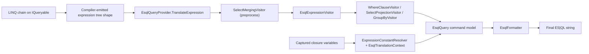

# LINQ translation architecture

This page explains how `Elastic.Esql` turns idiomatic LINQ into ES|QL.

## Why this is idiomatic LINQ

`Elastic.Esql` implements the standard `IQueryable` provider pattern:

- You compose queries with familiar LINQ operators (`Where`, `Select`, `GroupBy`, `OrderBy`, ...).
- The query is represented as an expression tree (`System.Linq.Expressions.Expression`).
- The provider inspects that tree and translates it to a backend query language (ES|QL).

This is the same architectural model used by other LINQ providers, which is why the API feels natural to C# developers.

## Compile-time expression tree generation

When a lambda targets `Expression<Func<...>>` (as in `Queryable.Where`), the compiler emits code that builds an expression tree object graph instead of a compiled delegate.

At runtime, `Elastic.Esql` receives that tree through `IQueryable.Expression` and translates it.

## End-to-end translation flow

## Runtime components

- `EsqlQueryable<T>` (`src/Elastic.Esql/Core/EsqlQueryable.cs`)
  - Exposes the LINQ surface and delegates translation to the provider.
- `EsqlQueryProvider` (`src/Elastic.Esql/Core/EsqlQueryProvider.cs`)
  - Entry point that invokes translation and formatting.
- `SelectMergingVisitor` (`src/Elastic.Esql/Translation/SelectMergingVisitor.cs`)
  - Pre-optimizes consecutive `Select` calls.
- `EsqlExpressionVisitor` (`src/Elastic.Esql/Translation/EsqlExpressionVisitor.cs`)
  - Walks method calls and emits ES|QL command-model nodes.
- `WhereClauseVisitor`, `SelectProjectionVisitor`, `GroupByVisitor` (`src/Elastic.Esql/Translation`)
  - Translate predicate/projection/grouping details.
- `EsqlFormatter` (`src/Elastic.Esql/Generation/EsqlFormatter.cs`)
  - Renders the command model into pipe-delimited ES|QL text.

## Captured variable handling

Closure-captured values (for example `minStatus` in `.Where(x => x.StatusCode >= minStatus)`) are resolved during translation and can be emitted in two modes:

- Inline literals (default): `statusCode >= 500`
- Named placeholders: `statusCode >= ?minStatus` with parameter payload from `.GetParameters()`

This behavior is controlled by `ToEsqlString(inlineParameters: bool)`.
